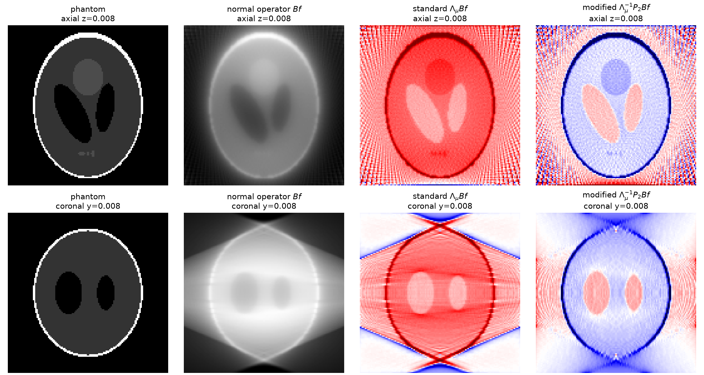

# Circular cone-beam X-ray transform: microlocal artifact reduction

**Status: ongoing research.** This project studies streak artifacts associated
with a circular X-ray source trajectory. A self-contained numerical experiment
compares an elliptic local reconstruction with a microlocally modified operator
on a synthetic 3-D phantom. Convergence and parameter-sensitivity studies remain
in progress.

The original MATLAB code was converted to Python using Codex.

## Experiment

[Cone_Beam_CT_Artifact_Reduction.ipynb](Cone_Beam_CT_Artifact_Reduction.ipynb)
contains the operator definitions, implementation, numerical consistency check,
and reconstruction experiment. All data are generated within the notebook.



*Default experiment: 128³ voxels, 120 source angles, and a 256 × 256 detector.
Each non-phantom slice is scaled by its own 99.5th percentile of absolute
intensity; the signed panels have limits −1 to 1. This display compares spatial
structure rather than absolute reconstruction intensities.*

The saved run gives the following diagnostic on the central coronal slice,
after normalization by the 95th-percentile response on a phantom-edge mask:

| Reconstruction | Outside amplitude RMS | Outside gradient RMS |
|---|---:|---:|
| Standard elliptic | 0.1817 | 0.7696 |
| Microlocally modified | 0.1466 | 0.2199 |

The outside-gradient diagnostic decreases by approximately **71.4%** in this
experiment. It uses the known phantom support and is not a general image-quality
score. At 24³ voxels and eight views, the detector-based normal operator differs
from the direct ray-integration reference by approximately **4.1%** in relative
L² norm, within the 6% check tolerance. Both implementations share interpolation
and quadrature conventions; this is a numerical consistency check.

[results/demo_results.json](results/demo_results.json) records the full-precision
metrics, parameters, package versions, execution timestamp, and measured stage
timings. These are regenerated by the notebook. Timings depend on the machine;
the optional large-grid sweep is disabled in the default run.

## Problem setup

The source circle is $a(t)=R(\cos t,\sin t,0)$, with $R=2$, and the object is
supported in $[-1,1]^3$. For unit directions $\theta$, the X-ray transform and
back-projection with data measure $dt\,d\theta$ are

$$
(R_Cf)(t,\theta)=\int_0^\infty f(a(t)+s\theta)\,ds,
\qquad
(R_C^*g)(x)=\int_0^{2\pi}
\frac{g\!\left(t,\frac{x-a(t)}{|x-a(t)|}\right)}{|x-a(t)|^2}\,dt.
$$

Writing $B=R_C^*R_C$, the two reconstructions are

$$
L_{\mathrm{standard}}=\Lambda_\mu B,
\qquad
L_{\mathrm{modified}}=\Lambda_\mu^{-1}P_2(x,D)B,
$$

where $\Lambda_\mu$ has symbol $(\mu^2+|\xi|^2)^{1/2}$, with $\mu=\pi$, and

$$
p_2(x,\xi)=(x\cdot\xi)^2-R^2(\xi_1^2+\xi_2^2),
\qquad
P_2(x,D)=\sum_{i,j=1}^3x_ix_jD_iD_j-R^2(D_1^2+D_2^2),
\quad D_j=-i\partial_{x_j}.
$$

The spatial coefficients multiply after differentiation. The symbol vanishes
on the two characteristic sheets $x\cdot\xi=\pm R|\xi_h|$, motivating the
artifact-reducing filter. The notebook gives the discretization details.

## Reproduction

Tested environment: Python 3.11 on macOS (Apple silicon), using the pinned
dependencies in [requirements.txt](requirements.txt). A CPU is sufficient for
the default experiment; MATLAB and external datasets are unnecessary.

From a terminal, the repository and environment setup on macOS/Linux is:

```sh
git clone https://github.com/ashwintan1/XRay_Streaking_Artifacts.git
cd XRay_Streaking_Artifacts
python3.11 -m venv .venv
source .venv/bin/activate
python -m pip install -r requirements.txt
```

The equivalent environment commands in Windows PowerShell are:

```powershell
py -3.11 -m venv .venv
.venv\Scripts\Activate.ps1
python -m pip install -r requirements.txt
```

VS Code execution:

1. Repository folder open in VS Code, with Microsoft's **Python** and
   **Jupyter** extensions installed.
2. Notebook kernel set through **Select Kernel → Python Environments → .venv**.
   Interpreter path: `.venv/bin/python` on macOS/Linux or
   `.venv\Scripts\python.exe` on Windows.
3. **Restart Kernel**, followed by **Run All** and notebook save.

The run produces the numerical-check output, reconstruction figure, metric
table, `figures/artifact_comparison.png`, and `results/demo_results.json`.
`N`, `N_ANGLES`, and `SOURCE_RADIUS` are defined in the phantom-experiment cell.
The optional scaling sweep is controlled by `RUN_STRESS_BENCHMARKS`.

## Repository contents

| File or directory | Role |
|---|---|
| `Cone_Beam_CT_Artifact_Reduction.ipynb` | Supported, self-contained experiment |
| `requirements.txt` | Pinned notebook and kernel dependencies |
| `figures/` | Reconstruction comparison exported by the notebook |
| `results/` | Numerical results and execution metadata |
| `THIRD_PARTY_NOTICES.md` | Source attribution and original phantom notice |
| `.vscode/` | Portable interpreter setting and extension recommendations |

The local `.venv`, Python caches, and session-history files are excluded from
version control.

## Limitations and next steps

- The output is a local reconstruction from the normal operator, not an FDK
  inversion or calibrated attenuation map.
- The source trajectory and detector are idealized, and the data are noiseless.
- Finite angular sampling, detector interpolation, and periodic FFT boundaries
  introduce numerical artifacts in addition to those of the continuous operator.
- Resolution, angular sampling, detector oversampling, and smoothing-order
  studies are planned, with measurements of both artifact suppression and edge
  fidelity.
- Behavior near intersecting characteristic sheets, noisy data, and calibrated
  scanner geometry remains to be investigated.

## References and attribution

David Finch, Ih-Ren Lan and Gunther Uhlmann (2003),
*Microlocal Analysis of the X-Ray Transform with Sources on a Curve*,
Inside Out: Inverse Problems and Applications, MSRI Publications 47, 193–218.
[Chapter PDF](https://library.slmath.org/books/Book47/files/uhlmann.pdf).

The original MATLAB archive `fwd.zip` is a development reference and is not
distributed or required here. The phantom is adapted from Matthias Christian
Schabel's `phantom3d.m` (2005). Its original GPL notice, which does not specify a
version, and the implementation provenance are preserved in
[THIRD_PARTY_NOTICES.md](THIRD_PARTY_NOTICES.md). No repository-wide license has
been selected.
